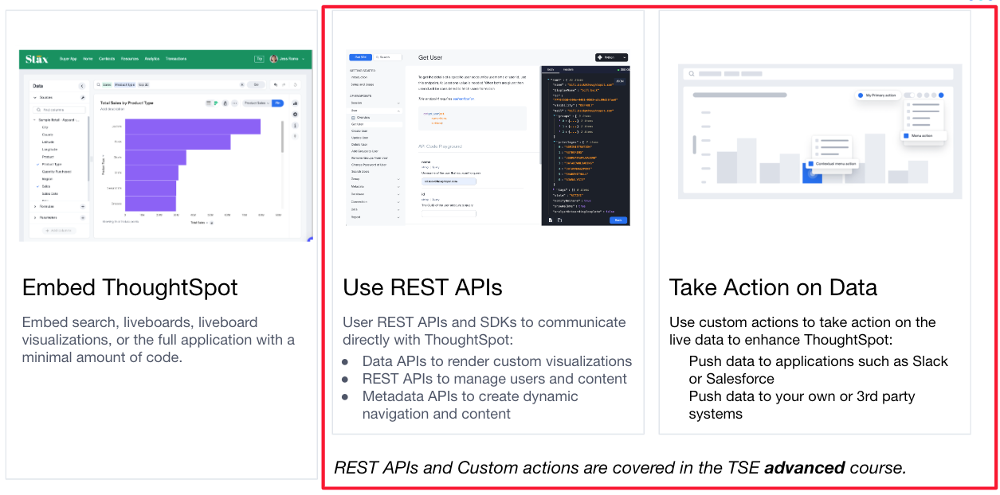
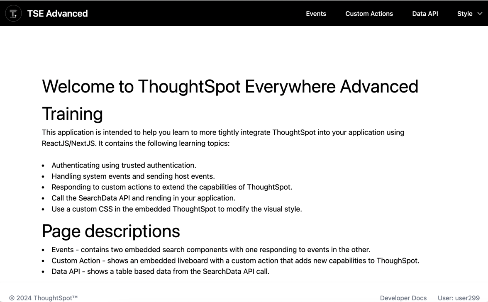

# Lesson 1: TSE Advanced Course Overview

In this lesson we're going to expand on the fundamentals of ThoughtSpot embedding to talk about more advanced topics
such as trusted authentication, bi-direction events between your application and ThoughtSpot, creating and using custom
actions, calling the APIs to get data, and applying a custom style. We refer to these topics as being "advanced" because
they have more complex coding requirements than the basic embedding.

You should have already taken the fundamentals course, either in
an [instructor led course](https://training.thoughtspot.com/thoughtspot-embedded-embedding-fundamentals-for-javascript-developers)
or using the [step-by-step course](https://github.com/thoughtspot/tse-fundamentals-step-by-step) for fundamentals. We
won't cover basics from the fundamentals course in this course, so you are expected to understand how to use the
Developer Playground in ThoughtSpot.

## Course development goals
In this course, we'll build out the following application:

The home page describes the overall goals of the course as well as the page descriptions.  In particular, we will do the following:

* Add authentication to the application using Trusted Authentication.
* Use events to integrate our application with ThoughtSpot, so we respond to events from ThoughtSpot and send events to ThoughtSpot.
* Use a custom action to add our own capabilities to ThoughtSpot.
* Use the API SDK to get data from ThoughtSpot and render as a table.
* Apply custom styles to the embedded ThoughtSpot to provide a 'dark mode'.

[next >](../lesson-02-setting-up/README-02.md)
