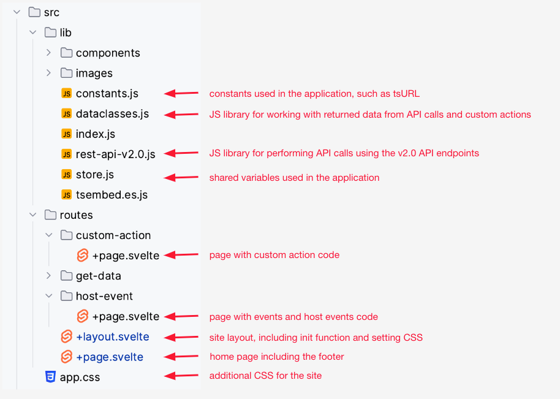

# Setting up for the course

In this lesson we'll download the code for the course and install needed packages to get our starting project. Then
we'll do a quick review of the code structure before we start coding.

## Getting the code

Before getting the code, you first need to have Node.js and (optionally) git installed. If you don't see
the [Home page](../README.md) for links to install.

You must also have the following three settings set to be your host (usually localhost:3000):

* CSP visual embed hosts
* CSP connect-src domains
* CORS whitelisted domains

To set these you need to be a cluster admin or developer in the primary org. See
the [Security Settings documentation](https://developers.thoughtspot.com/docs/security-settings) for how to set these
values.

### Download

For this project, we're going to use the code from
the [TSE Advanced Tutorial](https://github.com/thoughtspot/tse-advanced-tutorial). This is the same code that is used in
our instructor led course, though we'll deviate slightly in one section. Don't worry, you'll be told when.

There are two ways to download the code.

1. You can use git from the command line.
2. You can download from GitHub as a .zip and unzip locally. Both approaches work.

To download from using git, first open a terminal and navigate to a directory to install into. The project will be a
subdirectory in that directory. Next run the
command:  `git clone https://github.com/thoughtspot/tse-advanced-tutorial.git`. You should see content download and have
a directory called `tse-advanced-tutorial`.

To download as a .zip file, navigate to the repository in your browser, click on the green code button to get the
dropdown, and then click no Download ZIP. This will download a .zip file into your download folder. Once downloaded, you
can move the .zip file and then simply double click to expand. You will end up with a subdirectory
called `tse-advanced-tutorial-master`.

### Install

Now change to that directory at the command line and run `npm install`. You should see several packages download.

## Test run the application

Finally, run `npm run dev` from the command line in the same folder. You should see output like the following:

If successful, you should be able to open the link in the tab. In this case localhost:3000.

## Reviewing the project code

This project is written in [Svelte](https://svelte.dev/) and [SvelteKit](https://kit.svelte.dev/), a Javascript framework
similar to using React and Next.js. Don't worry, you won't have to fully understand the framework, the important parts
will be explained. And all code will be in Vanilla Javascript.

### The important files

The following image shows the important folders and files you need to understand.

All the code to be changed is located in the `src` folder or sub-folders. There are many other folders outside this
structure, but these don't need to be changed for the course.

Within the `src` folder there is a `lib` folder that holds common content (and has a special way to import)
and `routes`, which define the URLs to parts of the application.

#### Lib files

The following `lib` files are the most important for this course. Some will be updated and some will be used.

* constants.js - contains some constants for our project and will be updated.
* dataclasses.js - contains classes for working with data content received from API calls and events.
* rest-api-v2.0.js - contains a generic API capability for calling APIs. Only the APIs we need are included, but this
  file can easily be extended for additional API calls. Note that ThoughtSpot has a more
  comprehensive [TypeScript SDK](https://developers.thoughtspot.com/docs/rest-api-sdk-typescript) that can be used in
  production environments when using TypeScript.
* store.js - contains variables that can be updated. A store is a special concept in SvelteKit for managing shared
  state, similar to using Redux or similar with React.

#### Routes

The `routes` folder has paths to parts of the application. For example, https://myapp.com/dosomething would have a route
called `dosomething` and have a folder with that name in the `routes` directory. The root `routes` folder equates to the
URL, i.e. https://myapp.com.

Within a folder, you can have several supporting files. However, some are special to SvelteKit and specified by name.

* +layout.svelte.js indicates a layout for that route and any routes below it. This is useful for things like headers,
  menus, etc.
* +page.svelte.js is the content of a web page that is made up of code, HTML, and (optional) that applies to the
  particular page.
* +server.page.js is content that is rendered server side vs. in the client. This is usually used for backend
  capabilities that are not appropriate for the client.

Take some time to explore the different file types and become familiar with them. All code updates will tell you the specific file and section to update.

Now that we've covered the project structure, it's time to start updating the project.  

[< prev](../lesson-01-course-overview/README-01.md) | [next >](../lesson-03-trusted-authentication/README-03.md)